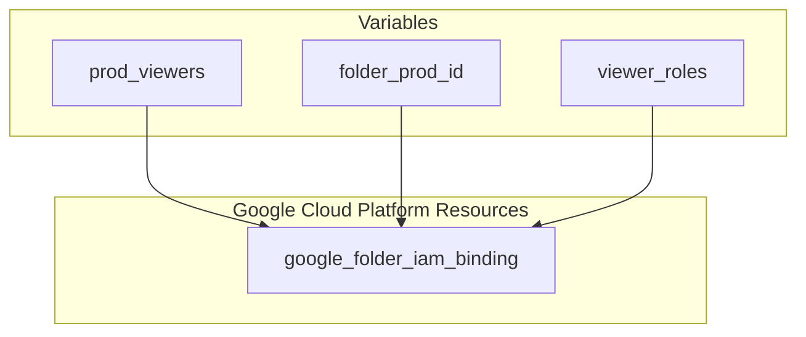

# GCP Viewer Role Terraform Configuration

This Terraform configuration sets up a real, modern Google Cloud Platform (GCP) Viewer - Read Only role, including all the necessary services required for smooth and efficient operations. The configuration utilizes Terraform to define the resources and permissions.

## Prerequisites

Before applying this Terraform configuration, ensure you have the following prerequisites:

- Terraform installed on your machine.
- Appropriate Google Cloud credentials and permissions to create IAM bindings.

## Usage

1. Clone the repository:

    ```bash
    git clone https://github.com/CB-cloudbit/Public.git
    ```

2. Navigate to the Terraform configuration directory:

    ```bash
    cd Public/Terraform/GCP_Viewer_role
    ```

3. Customize the variables in the `main.tf` file if needed. The main variables include:

   - `prod_viewers`: List of members for the Viewer role.
   - `folder_prod_id`: ID of the GCP folder where the IAM bindings will be applied.
   - `viewer_roles`: List of GCP roles to be assigned to the specified members.

   Ensure that you include/exclude roles based on your specific requirements.

4. Run Terraform to apply the configuration:

    ```bash
    terraform init
    terraform apply
    ```

5. Confirm the changes by typing `yes` when prompted.

## Structure

The Terraform configuration is structured as follows:

- `variables.tf`: Defines the input variables.
- `main.tf`: Contains the main Terraform configuration.
- `outputs.tf`: Defines the output values, if needed.

## Contributing

Contributions to enhance or expand this Terraform configuration are welcome! Feel free to fork the repository and submit pull requests with improvements or additional features.

## Disclaimer

This Terraform configuration is provided as-is, and users are responsible for reviewing and adapting it to their specific requirements. Cloudbit and the contributors are not liable for any issues or consequences arising from the use of this configuration.

## License

This project is licensed under the [MIT License](LICENSE).
